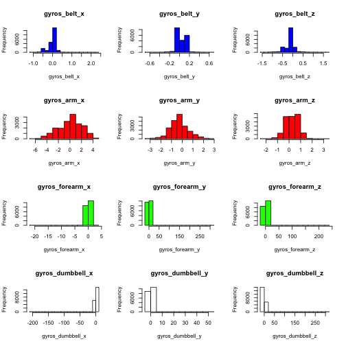

Using Random Forests to Predict Dumbell Curl Technique from On-Body Sensors
========================================================

## Synopsis

This report describes the process of taking raw data from on-body sensors and building a classification model to predict _"how well"_ a sporting exercise is performed. The data contained acceleration and gyroscopic data from sensors placed at different points on the body of participants who performed a dumbell curl using five different techniques (one technique being correct and the other four being incorrect, representing common weightlifting mistakes).

After performing some exploratory analysis the raw data was pre-processed using techniques such as normalisation and variables with missing values were removed, leaving a dataset containing only those variables/predictors which best represented the variance in the data. Principal Component Analysis was then performed on the data to select only the predictors which represented the most of the variance in the data to use for prediction. 

After splitting the data into a training and cross validation set, a Random Forest model was built on the training data using the principal components identified previously. 

_The resulting random forest has a prediction accuracy of 97% which gives an out of sample error of 3%_

### The Data
The data comes from the "Weight Lifting Exercise" from the following project:

http://groupware.les.inf.puc-rio.br/har

In the project six young health participants were asked to perform one set of 10 repetitions of the Unilateral Dumbbell Biceps Curl in five different fashions: exactly according to the specification (Class A), throwing the elbows to the front (Class B), lifting the dumbbell only halfway (Class C), lowering the dumbbell only halfway (Class D) and throwing the hips to the front (Class E).

On-Body sensors were placed on the arm, forearm, belt and on the dumbell which recorded metrics such as acceleration (X,Y,Z), yaw, pitch, roll etc. 

---------------------------

## Load the data


First we load the training data as a data frame and the necessary libraries. The _caret_ package was used for preprocessing the data and the _kernlab_ and _randomForest_ packages for building and training the model. 


```r
library(caret)
library(randomForest)
library(kernlab)
data <- read.csv("pml-training.csv")
```


---------------------------

## Pre-Processing

Before looking at the data it is worth checking if there is any variables with missing data. 


```r
numNas <- colSums(is.na(data))
table(numNas)
```

```
## numNas
##     0 19216 
##    93    67
```


Here we can see that there are 67 columns which have missing values (NAs) of which they all have the same number of missing values. Since they all have the same number of missing values this this suggests that the missing values are a result of the equipment/sensors used and, because there are so many missing values (19216), it is not worth trying to impute them.

Therefore we just remove these values


```r
data <- data[numNas == 0]
```


Next, it is a good idea to start by looking at the data:


```r
str(data)
```

```
## 'data.frame':	19622 obs. of  93 variables:
##  $ X                      : int  1 2 3 4 5 6 7 8 9 10 ...
##  $ user_name              : Factor w/ 6 levels "adelmo","carlitos",..: 2 2 2 2 2 2 2 2 2 2 ...
##  $ raw_timestamp_part_1   : int  1323084231 1323084231 1323084231 1323084232 1323084232 1323084232 1323084232 1323084232 1323084232 1323084232 ...
##  $ raw_timestamp_part_2   : int  788290 808298 820366 120339 196328 304277 368296 440390 484323 484434 ...
##  $ cvtd_timestamp         : Factor w/ 20 levels "02/12/2011 13:32",..: 9 9 9 9 9 9 9 9 9 9 ...
##  $ new_window             : Factor w/ 2 levels "no","yes": 1 1 1 1 1 1 1 1 1 1 ...
##  $ num_window             : int  11 11 11 12 12 12 12 12 12 12 ...
##  $ roll_belt              : num  1.41 1.41 1.42 1.48 1.48 1.45 1.42 1.42 1.43 1.45 ...
##  $ pitch_belt             : num  8.07 8.07 8.07 8.05 8.07 8.06 8.09 8.13 8.16 8.17 ...
##  $ yaw_belt               : num  -94.4 -94.4 -94.4 -94.4 -94.4 -94.4 -94.4 -94.4 -94.4 -94.4 ...
##  $ total_accel_belt       : int  3 3 3 3 3 3 3 3 3 3 ...
##  $ kurtosis_roll_belt     : Factor w/ 397 levels "","-0.016850",..: 1 1 1 1 1 1 1 1 1 1 ...
##  $ kurtosis_picth_belt    : Factor w/ 317 levels "","-0.021887",..: 1 1 1 1 1 1 1 1 1 1 ...
##  $ kurtosis_yaw_belt      : Factor w/ 2 levels "","#DIV/0!": 1 1 1 1 1 1 1 1 1 1 ...
##  $ skewness_roll_belt     : Factor w/ 395 levels "","-0.003095",..: 1 1 1 1 1 1 1 1 1 1 ...
##  $ skewness_roll_belt.1   : Factor w/ 338 levels "","-0.005928",..: 1 1 1 1 1 1 1 1 1 1 ...
##  $ skewness_yaw_belt      : Factor w/ 2 levels "","#DIV/0!": 1 1 1 1 1 1 1 1 1 1 ...
##  $ max_yaw_belt           : Factor w/ 68 levels "","-0.1","-0.2",..: 1 1 1 1 1 1 1 1 1 1 ...
##  $ min_yaw_belt           : Factor w/ 68 levels "","-0.1","-0.2",..: 1 1 1 1 1 1 1 1 1 1 ...
##  $ amplitude_yaw_belt     : Factor w/ 4 levels "","#DIV/0!","0.00",..: 1 1 1 1 1 1 1 1 1 1 ...
##  $ gyros_belt_x           : num  0 0.02 0 0.02 0.02 0.02 0.02 0.02 0.02 0.03 ...
##  $ gyros_belt_y           : num  0 0 0 0 0.02 0 0 0 0 0 ...
##  $ gyros_belt_z           : num  -0.02 -0.02 -0.02 -0.03 -0.02 -0.02 -0.02 -0.02 -0.02 0 ...
##  $ accel_belt_x           : int  -21 -22 -20 -22 -21 -21 -22 -22 -20 -21 ...
##  $ accel_belt_y           : int  4 4 5 3 2 4 3 4 2 4 ...
##  $ accel_belt_z           : int  22 22 23 21 24 21 21 21 24 22 ...
##  $ magnet_belt_x          : int  -3 -7 -2 -6 -6 0 -4 -2 1 -3 ...
##  $ magnet_belt_y          : int  599 608 600 604 600 603 599 603 602 609 ...
##  $ magnet_belt_z          : int  -313 -311 -305 -310 -302 -312 -311 -313 -312 -308 ...
##  $ roll_arm               : num  -128 -128 -128 -128 -128 -128 -128 -128 -128 -128 ...
##  $ pitch_arm              : num  22.5 22.5 22.5 22.1 22.1 22 21.9 21.8 21.7 21.6 ...
##  $ yaw_arm                : num  -161 -161 -161 -161 -161 -161 -161 -161 -161 -161 ...
##  $ total_accel_arm        : int  34 34 34 34 34 34 34 34 34 34 ...
##  $ gyros_arm_x            : num  0 0.02 0.02 0.02 0 0.02 0 0.02 0.02 0.02 ...
##  $ gyros_arm_y            : num  0 -0.02 -0.02 -0.03 -0.03 -0.03 -0.03 -0.02 -0.03 -0.03 ...
##  $ gyros_arm_z            : num  -0.02 -0.02 -0.02 0.02 0 0 0 0 -0.02 -0.02 ...
##  $ accel_arm_x            : int  -288 -290 -289 -289 -289 -289 -289 -289 -288 -288 ...
##  $ accel_arm_y            : int  109 110 110 111 111 111 111 111 109 110 ...
##  $ accel_arm_z            : int  -123 -125 -126 -123 -123 -122 -125 -124 -122 -124 ...
##  $ magnet_arm_x           : int  -368 -369 -368 -372 -374 -369 -373 -372 -369 -376 ...
##  $ magnet_arm_y           : int  337 337 344 344 337 342 336 338 341 334 ...
##  $ magnet_arm_z           : int  516 513 513 512 506 513 509 510 518 516 ...
##  $ kurtosis_roll_arm      : Factor w/ 330 levels "","-0.02438",..: 1 1 1 1 1 1 1 1 1 1 ...
##  $ kurtosis_picth_arm     : Factor w/ 328 levels "","-0.00484",..: 1 1 1 1 1 1 1 1 1 1 ...
##  $ kurtosis_yaw_arm       : Factor w/ 395 levels "","-0.01548",..: 1 1 1 1 1 1 1 1 1 1 ...
##  $ skewness_roll_arm      : Factor w/ 331 levels "","-0.00051",..: 1 1 1 1 1 1 1 1 1 1 ...
##  $ skewness_pitch_arm     : Factor w/ 328 levels "","-0.00184",..: 1 1 1 1 1 1 1 1 1 1 ...
##  $ skewness_yaw_arm       : Factor w/ 395 levels "","-0.00311",..: 1 1 1 1 1 1 1 1 1 1 ...
##  $ roll_dumbbell          : num  13.1 13.1 12.9 13.4 13.4 ...
##  $ pitch_dumbbell         : num  -70.5 -70.6 -70.3 -70.4 -70.4 ...
##  $ yaw_dumbbell           : num  -84.9 -84.7 -85.1 -84.9 -84.9 ...
##  $ kurtosis_roll_dumbbell : Factor w/ 398 levels "","-0.0035","-0.0073",..: 1 1 1 1 1 1 1 1 1 1 ...
##  $ kurtosis_picth_dumbbell: Factor w/ 401 levels "","-0.0163","-0.0233",..: 1 1 1 1 1 1 1 1 1 1 ...
##  $ kurtosis_yaw_dumbbell  : Factor w/ 2 levels "","#DIV/0!": 1 1 1 1 1 1 1 1 1 1 ...
##  $ skewness_roll_dumbbell : Factor w/ 401 levels "","-0.0082","-0.0096",..: 1 1 1 1 1 1 1 1 1 1 ...
##  $ skewness_pitch_dumbbell: Factor w/ 402 levels "","-0.0053","-0.0084",..: 1 1 1 1 1 1 1 1 1 1 ...
##  $ skewness_yaw_dumbbell  : Factor w/ 2 levels "","#DIV/0!": 1 1 1 1 1 1 1 1 1 1 ...
##  $ max_yaw_dumbbell       : Factor w/ 73 levels "","-0.1","-0.2",..: 1 1 1 1 1 1 1 1 1 1 ...
##  $ min_yaw_dumbbell       : Factor w/ 73 levels "","-0.1","-0.2",..: 1 1 1 1 1 1 1 1 1 1 ...
##  $ amplitude_yaw_dumbbell : Factor w/ 3 levels "","#DIV/0!","0.00": 1 1 1 1 1 1 1 1 1 1 ...
##  $ total_accel_dumbbell   : int  37 37 37 37 37 37 37 37 37 37 ...
##  $ gyros_dumbbell_x       : num  0 0 0 0 0 0 0 0 0 0 ...
##  $ gyros_dumbbell_y       : num  -0.02 -0.02 -0.02 -0.02 -0.02 -0.02 -0.02 -0.02 -0.02 -0.02 ...
##  $ gyros_dumbbell_z       : num  0 0 0 -0.02 0 0 0 0 0 0 ...
##  $ accel_dumbbell_x       : int  -234 -233 -232 -232 -233 -234 -232 -234 -232 -235 ...
##  $ accel_dumbbell_y       : int  47 47 46 48 48 48 47 46 47 48 ...
##  $ accel_dumbbell_z       : int  -271 -269 -270 -269 -270 -269 -270 -272 -269 -270 ...
##  $ magnet_dumbbell_x      : int  -559 -555 -561 -552 -554 -558 -551 -555 -549 -558 ...
##  $ magnet_dumbbell_y      : int  293 296 298 303 292 294 295 300 292 291 ...
##  $ magnet_dumbbell_z      : num  -65 -64 -63 -60 -68 -66 -70 -74 -65 -69 ...
##  $ roll_forearm           : num  28.4 28.3 28.3 28.1 28 27.9 27.9 27.8 27.7 27.7 ...
##  $ pitch_forearm          : num  -63.9 -63.9 -63.9 -63.9 -63.9 -63.9 -63.9 -63.8 -63.8 -63.8 ...
##  $ yaw_forearm            : num  -153 -153 -152 -152 -152 -152 -152 -152 -152 -152 ...
##  $ kurtosis_roll_forearm  : Factor w/ 322 levels "","-0.0227","-0.0359",..: 1 1 1 1 1 1 1 1 1 1 ...
##  $ kurtosis_picth_forearm : Factor w/ 323 levels "","-0.0073","-0.0442",..: 1 1 1 1 1 1 1 1 1 1 ...
##  $ kurtosis_yaw_forearm   : Factor w/ 2 levels "","#DIV/0!": 1 1 1 1 1 1 1 1 1 1 ...
##  $ skewness_roll_forearm  : Factor w/ 323 levels "","-0.0004","-0.0013",..: 1 1 1 1 1 1 1 1 1 1 ...
##  $ skewness_pitch_forearm : Factor w/ 319 levels "","-0.0113","-0.0131",..: 1 1 1 1 1 1 1 1 1 1 ...
##  $ skewness_yaw_forearm   : Factor w/ 2 levels "","#DIV/0!": 1 1 1 1 1 1 1 1 1 1 ...
##  $ max_yaw_forearm        : Factor w/ 45 levels "","-0.1","-0.2",..: 1 1 1 1 1 1 1 1 1 1 ...
##  $ min_yaw_forearm        : Factor w/ 45 levels "","-0.1","-0.2",..: 1 1 1 1 1 1 1 1 1 1 ...
##  $ amplitude_yaw_forearm  : Factor w/ 3 levels "","#DIV/0!","0.00": 1 1 1 1 1 1 1 1 1 1 ...
##  $ total_accel_forearm    : int  36 36 36 36 36 36 36 36 36 36 ...
##  $ gyros_forearm_x        : num  0.03 0.02 0.03 0.02 0.02 0.02 0.02 0.02 0.03 0.02 ...
##  $ gyros_forearm_y        : num  0 0 -0.02 -0.02 0 -0.02 0 -0.02 0 0 ...
##  $ gyros_forearm_z        : num  -0.02 -0.02 0 0 -0.02 -0.03 -0.02 0 -0.02 -0.02 ...
##  $ accel_forearm_x        : int  192 192 196 189 189 193 195 193 193 190 ...
##  $ accel_forearm_y        : int  203 203 204 206 206 203 205 205 204 205 ...
##  $ accel_forearm_z        : int  -215 -216 -213 -214 -214 -215 -215 -213 -214 -215 ...
##  $ magnet_forearm_x       : int  -17 -18 -18 -16 -17 -9 -18 -9 -16 -22 ...
##  $ magnet_forearm_y       : num  654 661 658 658 655 660 659 660 653 656 ...
##  $ magnet_forearm_z       : num  476 473 469 469 473 478 470 474 476 473 ...
##  $ classe                 : Factor w/ 5 levels "A","B","C","D",..: 1 1 1 1 1 1 1 1 1 1 ...
```


From this there are a few variables to pick out:

* An "X" variable seems to be an id variable and therefore would be different for each observation and add nothing to the model. This should be removed.
* A factor "user_name" variable which represents the name of the participant.
* A "cvtd_timestamp" variable which represents the date and time.
* Also the timestamp seems to have been split into two variables "rawtimestamppart1" and "rawtimestamppart1".

### Cleaning data

First things first lets turn the factor "username" variables to quantitative indicator values using dummy variables. Factor variables such as this, where the values are just a set of characters, make it difficult for prediction algorithms to use them qualitiatively, and some even won't work unless all data is numeric. To turn these factor variables into quantitative variables the model can use we use the _dummyVars_ function in the caret package. 


```r
nameDummies <- dummyVars(X ~ user_name, data = data)
data <- cbind(predict(nameDummies, newdata = data), data)
data <- data[, -(which(names(data) == "user_name"))]  # remove user_name variable
```


Now lets look at the timestamp variable. A variables such as this whereby the values are split into two variables won't add anything to the model because, in this example, the first part of the timestamp will be the same for many of the observations. Therefore we need to combine the two timestamp variables into a single value and remove the old values:


```r
timestamp <- paste(data$raw_timestamp_part_1, data$raw_timestamp_part_2)
timestamp <- as.numeric(gsub(" ", "", timestamp))
data <- cbind(timestamp, data)

# remove old timestamp variables
data <- data[, -(which(names(data) == "raw_timestamp_part_1"))]
data <- data[, -(which(names(data) == "raw_timestamp_part_2"))]
data <- data[, -(which(names(data) == "cvtd_timestamp"))]
```


Now lets see which variables are least useful using Near Zero Variables, specifically the _nearZeroVar_ function in the caret package:

```r
nzv <- nearZeroVar(data, saveMetrics = TRUE)
nzv[which(nzv$nzv == TRUE), ]  # Only show which ones are true
```

```
##                         freqRatio percentUnique zeroVar  nzv
## new_window                  47.33       0.01019   FALSE TRUE
## kurtosis_roll_belt        1921.60       2.02324   FALSE TRUE
## kurtosis_picth_belt        600.50       1.61553   FALSE TRUE
## kurtosis_yaw_belt           47.33       0.01019   FALSE TRUE
## skewness_roll_belt        2135.11       2.01305   FALSE TRUE
## skewness_roll_belt.1       600.50       1.72256   FALSE TRUE
## skewness_yaw_belt           47.33       0.01019   FALSE TRUE
## max_yaw_belt               640.53       0.34655   FALSE TRUE
## min_yaw_belt               640.53       0.34655   FALSE TRUE
## amplitude_yaw_belt          50.04       0.02039   FALSE TRUE
## kurtosis_roll_arm          246.36       1.68179   FALSE TRUE
## kurtosis_picth_arm         240.20       1.67159   FALSE TRUE
## kurtosis_yaw_arm          1746.91       2.01305   FALSE TRUE
## skewness_roll_arm          249.56       1.68688   FALSE TRUE
## skewness_pitch_arm         240.20       1.67159   FALSE TRUE
## skewness_yaw_arm          1746.91       2.01305   FALSE TRUE
## kurtosis_roll_dumbbell    3843.20       2.02834   FALSE TRUE
## kurtosis_picth_dumbbell   9608.00       2.04362   FALSE TRUE
## kurtosis_yaw_dumbbell       47.33       0.01019   FALSE TRUE
## skewness_roll_dumbbell    4804.00       2.04362   FALSE TRUE
## skewness_pitch_dumbbell   9608.00       2.04872   FALSE TRUE
## skewness_yaw_dumbbell       47.33       0.01019   FALSE TRUE
## max_yaw_dumbbell           960.80       0.37203   FALSE TRUE
## min_yaw_dumbbell           960.80       0.37203   FALSE TRUE
## amplitude_yaw_dumbbell      47.92       0.01529   FALSE TRUE
## kurtosis_roll_forearm      228.76       1.64102   FALSE TRUE
## kurtosis_picth_forearm     226.07       1.64611   FALSE TRUE
## kurtosis_yaw_forearm        47.33       0.01019   FALSE TRUE
## skewness_roll_forearm      231.52       1.64611   FALSE TRUE
## skewness_pitch_forearm     226.07       1.62573   FALSE TRUE
## skewness_yaw_forearm        47.33       0.01019   FALSE TRUE
## max_yaw_forearm            228.76       0.22933   FALSE TRUE
## min_yaw_forearm            228.76       0.22933   FALSE TRUE
## amplitude_yaw_forearm       59.68       0.01529   FALSE TRUE
```


From this we can see that there are some variables which have very little or no variance and would not be of any benefit to the model as they would not be very good predictors. So lets remove these along with the "X" variables:


```r
data <- data[, which(nzv$nzv == FALSE)]
data <- data[-8]
```


### Normalising

The next step is to normalise the data; often data can be skewed which makes building a model very difficult. Particularly for PCA it is necessary to centre the data first. For example, looking at the histograms of some of the gyroscope variables in the plot below it is clear that some are very skewed, particularly for sensors on the forearm and dumbbell, therefore we centre and scale the data:


```r
par(mfrow = c(4, 3))
hist(data$gyros_belt_x, main = "gyros_belt_x", xlab = "gyros_belt_x", col = "blue")
hist(data$gyros_belt_y, main = "gyros_belt_y", xlab = "gyros_belt_y", col = "blue")
hist(data$gyros_belt_z, main = "gyros_belt_z", xlab = "gyros_belt_z", col = "blue")
hist(data$gyros_arm_x, main = "gyros_arm_x", xlab = "gyros_arm_x", col = "red")
hist(data$gyros_arm_y, main = "gyros_arm_y", xlab = "gyros_arm_y", col = "red")
hist(data$gyros_arm_z, main = "gyros_arm_z", xlab = "gyros_arm_z", col = "red")
hist(data$gyros_forearm_x, main = "gyros_forearm_x", xlab = "gyros_forearm_x", 
    col = "green")
hist(data$gyros_forearm_y, main = "gyros_forearm_y", xlab = "gyros_forearm_y", 
    col = "green")
hist(data$gyros_forearm_z, main = "gyros_forearm_z", xlab = "gyros_forearm_z", 
    col = "green")
hist(data$gyros_dumbbell_x, main = "gyros_dumbbell_x", xlab = "gyros_dumbbell_x")
hist(data$gyros_dumbbell_y, main = "gyros_dumbbell_y", xlab = "gyros_dumbbell_y")
hist(data$gyros_dumbbell_z, main = "gyros_dumbbell_z", xlab = "gyros_dumbbell_z")
```

 


```r
standardData <- preProcess(data[, -61], method = c("center", "scale"))
classe <- data[, 61]
data <- cbind(predict(standardData, data[, -61]), classe)
```


---------------------------

## Classification

### Cross Validation
In order to test the model we create we first need to split the training data into a training and cross validation set. It is important to select a random sample of the data to be the training set so that each of the classes is well represented. 

Here we create a random sampled partition in the data that represents 50% of the training set:


```r
folds <- createDataPartition(y = data$classe, times = 1, p = 0.5, list = TRUE)
training <- data[folds[[1]], ]
testing <- data[-folds[[1]], ]
```


### Principal Componant Analysis

The idea of Principal Component Analysis (PCA) is to pick a weighted selection of the multivariate predictors in the dataset such that the combination of these weighted predictors represents the most information possible. PCA is a useful technique for reducing the dimensionality of the data by reducing the number of predictors but also for removing noise. 

Therefore we apply PCA to calculate the predictors which retain the most variance. Here we have selected the predictors which retain 99% of the variance:


```r
preProc <- preProcess(training[-61], method = "pca", thresh = 0.99)
training.pca <- predict(preProc, training[, -61])
```


### Random Forest

_Random Forests_, essentially a collection of decision trees, is a widely used technique for classification and is known as being the most accurate. 

A _Decision Tree_ works by iteratively splitting the varibales into groups, evaluating the homogenaity within the group and then splitting again, until you are left with groups of similar variables which are small and "pure".

Random Forests works by first taking boostrap samples from the data, and then for each sample build a decision tree classify the data. The slight difference being that at each split on the tree, we again boostrap the variables, so only a sample of the variables are considered at each potential split. The idea is then to grow a large number of trees, and then vote on which tree provides the best prediction for the outcome. 

So here we use the new training data containing the best predictors (from PCA) to build a random forest classification model:


```r
modelFit <- train(training$classe ~ ., data = training.pca, method = "rf")
```


---------------------------

## Results

### Cross Validation

In order to test the model we need to apply the same pre-processing (PCA) to the cross validation set and use the random forest model to predict the "classe" variable:

```r
# Apply the same pre-processing to the training set and use the random
# forest model to predict the classe variable in the test set
testing.pca <- predict(preProc, testing[-61])
predictions <- predict(modelFit, testing.pca)

# Use a confusion matrix to visualise how good the model is
confusionMatrix(testing$classe, predictions)
```

```
## Confusion Matrix and Statistics
## 
##           Reference
## Prediction    A    B    C    D    E
##          A 2776    6    2    6    0
##          B   45 1829   16    0    8
##          C    1   33 1653   24    0
##          D    6    6   76 1510   10
##          E    0    1   13   16 1773
## 
## Overall Statistics
##                                         
##                Accuracy : 0.973         
##                  95% CI : (0.969, 0.976)
##     No Information Rate : 0.288         
##     P-Value [Acc > NIR] : <2e-16        
##                                         
##                   Kappa : 0.965         
##  Mcnemar's Test P-Value : NA            
## 
## Statistics by Class:
## 
##                      Class: A Class: B Class: C Class: D Class: E
## Sensitivity             0.982    0.975    0.939    0.970    0.990
## Specificity             0.998    0.991    0.993    0.988    0.996
## Pos Pred Value          0.995    0.964    0.966    0.939    0.983
## Neg Pred Value          0.993    0.994    0.987    0.994    0.998
## Prevalence              0.288    0.191    0.179    0.159    0.183
## Detection Rate          0.283    0.186    0.169    0.154    0.181
## Detection Prevalence    0.284    0.193    0.174    0.164    0.184
## Balanced Accuracy       0.990    0.983    0.966    0.979    0.993
```


### Out Of Sample Error

Looking at the Confusion Matrix (another function from the caret package) we can see how well the model predicts the classes in the cross validation set. 

Overall we can see that the model has an average Sensitivity of 0.98 across all of the classes and an average Specificity of 0.99. 

__The overall accuracy of the model is 97% which gives an out of sample error of 3%.__


